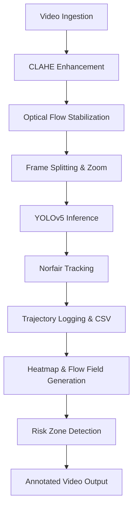

# CrowdFlowAI: AI-Powered Crowd Monitoring for Large Gatherings

## Background
Mass events like the Kumbh Mela draw millions of pilgrims into dense crowds. High population density can cause overcrowding, leading to stampedes and injuries. Traditional crowd-control methods and manual surveillance often fail to provide timely insights in such dynamic scenarios. Modern AI-driven video analytics can fill this gap – for example, real-time monitoring and predictive analytics have been shown to greatly improve safety and reduce congestion at large gatherings. CrowdFlowAI harnesses these techniques to enhance public safety, automatically analyzing CCTV feeds to detect people, track movements, and highlight potential risk zones.

## Key Features

🎥 **Video Enhancement**: Improves live CCTV footage using CLAHE (Contrast Limited Adaptive Histogram Equalization) and optical-flow stabilization. CLAHE adaptively increases contrast in local regions, and optical flow is used to compensate for camera motion, yielding clearer, steady frames for analysis.

🕵️‍♂️ **Pilgrim Detection**: Uses a fine-tuned YOLOv5 model specialized for small-head detection. The detector runs in real time, identifying and counting individual pilgrims in each frame, even in packed crowds.

🔄 **Individual Tracking**: Applies the Norfair multi-object tracker to link detections across frames. Each person's trajectory is followed over time, and their coordinates are logged to a CSV file for further analysis or review.

📊 **Crowd Analytics & Visualization**: Aggregates positional data into spatial heatmaps and flow vector fields. Heatmaps show crowd density hotspots, while flow fields indicate movement direction and speed across the scene. These visualizations help operators understand overall movement patterns and identify areas of concern.

⚠️ **High-Density Risk Alerts**: Detects overcrowded zones by blurring the density map and using cell-based aggregation. Regions where the local density exceeds safety thresholds are flagged as high-risk. These risk areas are visually marked (e.g. with color overlays) on output videos to draw immediate attention.

## Project Workflow

## 💡 Future Extensions (Planned):

🏃 **Panic Simulation**: Integrate agent-based crowd models to simulate emergency scenarios (e.g. stampedes or evacuations) and predict potential bottlenecks.

🚨 **Anomaly Detection**: Develop machine-learning modules to recognize unusual crowd behaviors or event patterns in real time, adding a layer of automated alerting for truly unexpected situations.

## Methodology

### Video Enhancement
Input CCTV frames are first preprocessed to improve visibility. We apply CLAHE to adjust local contrast: the frame is divided into tiles and each is contrast-equalized separately, avoiding over-exposure. This makes features like heads easier to detect in varying lighting. Next, we estimate optical flow between consecutive frames to detect and compensate for camera motion. Stabilizing the video in this way ensures that detected movement comes from people, not camera shake.

### Detection and Tracking
A fine-tuned YOLOv5 detector scans each enhanced frame to find heads (pilgrim detections). The model is trained on dense crowd data so it works well on small, occluded targets. Every detection is assigned a bounding box and a timestamp. These detections are passed to the Norfair tracker, a lightweight real-time multi-object tracking framework. Norfair links each bounding box to existing tracks (or starts a new track if it's a new person), smoothing their trajectories over time. The result is a series of tracked "pellets" moving through the scene. We log each individual's (x,y) coordinates per frame into a CSV file, creating a complete trajectory for every visible person. This makes it easy to analyze flow paths or replay movements offline.

### Heatmaps and Flow Analytics
From the tracked positions, CrowdFlowAI generates density heatmaps and motion flow fields. The heatmap is computed by accumulating all pedestrian locations over time: areas with many tracks become "hot." Likewise, we compute flow vectors by summarizing displacement of individuals across frames, illustrating dominant movement directions. This is analogous to GIS-based crowd density mapping, which real-time systems use to pinpoint overcrowding.

### Risk Zone Detection
To identify unsafe crowding, we blur the density heatmap to smooth out noise and then divide the scene into a grid of cells. For each cell, we calculate an aggregated density score. Cells exceeding a threshold (set by safety guidelines or learned from data) are flagged as high-density risk zones. These zones are highlighted visually (e.g. with red shading) in the output video. This makes it immediately obvious where intervention (such as crowd redirection or additional staff) may be needed.

## Dependencies

- Python 3.8+
- torch (PyTorch)
- torchvision
- opencv-python
- numpy
- pandas (for optional data analysis)
- norfair
- matplotlib (for heatmap plotting)
- seaborn (optional, for advanced visualizations)
- asyncio (built-in)

⚙️ Note: Versions should be compatible with YOLOv5 requirements (e.g., PyTorch ≥1.7, OpenCV ≥4.5).

## Future Work
CrowdFlowAI is designed to be extendable. On the roadmap are:

🏃 **Panic Simulation**: Adding agent-based crowd modeling to simulate how people would move under panic (e.g. during an emergency). This can help planners proactively test evacuation plans and identify hidden bottlenecks.

🚨 **Anomaly Detection**: Leveraging machine learning to spot unusual patterns (e.g. sudden surges, falls, or stalled movement) that deviate from normal behavior, triggering alerts for security teams.

By combining advanced video preprocessing, state-of-the-art detection and tracking, and smart analytics, CrowdFlowAI provides comprehensive real-time situational awareness in crowded venues. The system's outputs (count estimates, trajectories, heatmaps, and annotated video) empower organizers and safety personnel to make informed decisions and keep large gatherings safe. Sources: Contemporary research and tools inform our approach. For instance, enhanced YOLOv5 models improve crowd detection accuracy, while real-time density mapping is known to aid crowd management. 